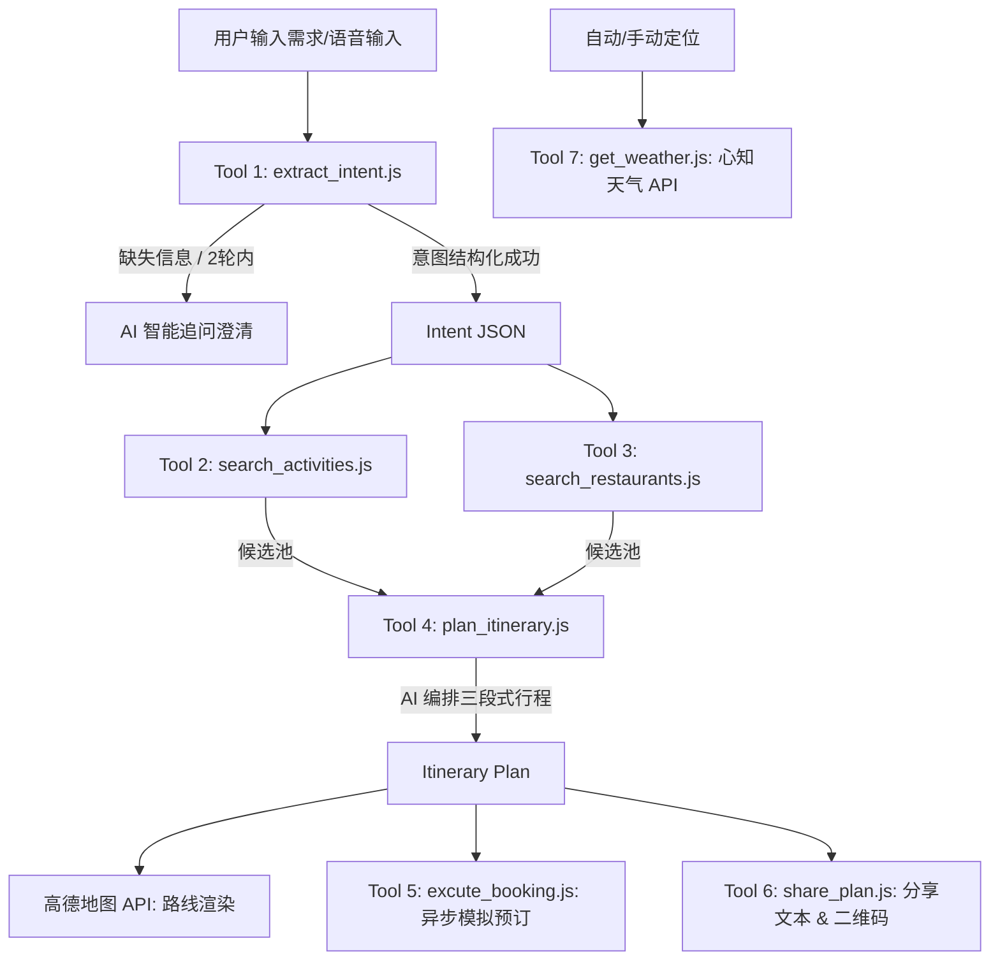

# EasyGo — 美团·周末活动规划 Agent 

EasyGo 是一个轻量、高效的本地周末出行规划智能助手（Agent）。该项目旨在为用户秒级规划 **4-6 小时** 的本地出行方案，涵盖“休闲活动 → 餐厅预约 → 后续安排”的完整链路。系统集成了高德地图 API、心知天气 API，并深度结合了智谱 GLM-4 与 DeepSeek 大语言模型，具备多轮意图追问、智能行程编排、模拟预订下单、二维码分享及长辈友好（无障碍语音）模式等核心能力。

slogan:no more waiting,just go
---

## 🎨 核心特性

1. **智能意图解析 (`extract_intent.js`)**
   * 支持智谱 GLM-4-Flash 与 DeepSeek-Chat 双模型。
   * 支持针对缺失关键字段（如出行人数 `adults`、出行人群 `group_type`）进行最多 2 轮的智能追问；超时或未配置 Key 时自动主动激活离线规则引擎，并告知用户AI 服务暂时繁忙，已用智能规则快速生成。
2. **候选搜索与过滤 (`search_activities.js` & `search_restaurants.js`)**
   * 根据出行半径（`radius_km`）、人群类型（如是否带小孩、是否有长辈）、健康饮食需求（少油少盐低卡等）对本地活动、景点与餐饮资源进行精细化过滤与推荐。
3. **AI 行程智能编排 (`plan_itinerary.js`)**
   * 采用 AI 将活动与餐饮候选串联为“活动 → 餐厅 → 活动”的三段式行程，合理估算时间戳、停留时长，并计算人均预估消费。支持大模型流式输出（Streaming）渲染。
4. **模拟一键预订 (`excute_booking.js`)**
   * 模拟对接美团商家预订接口。按行程顺序自动发起门票订购、餐厅留位、备注儿童椅/健康饮食等任务，支持异步重试和步骤进度的实时推送与渲染。
5. **高德地图深度整合 (`index.html`)**
   * 实现了自动定位与三级省市区手动定位微调。
   * 集成高德地图 JS API，支持地图卡片预览、路径规划（公交、驾车、步行）及大图全屏展示。
6. **实况天气与预报 (`get_weather.js`)**
   * 调用心知天气（Seniverse）API，实时渲染当前地点的天气现象代码、匹配官方图示以及气温。
7. **无障碍友好模式 (`index.html`)**
   * 专为老年人与视障群体设计，一键切换“友好模式”：界面字体放大、按钮高亮、高对比度。
   * 内置语音辅助播报（基于浏览器原生 Web Speech API），支持点击消息气泡/时间轴即时朗读，并配有暂停语音控制键。
8. **多渠道行程分享 (`share_plan.js`)**
   * 生成适配微信好友分享（带 Emoji 和排版）、TTS 朗读及 Compact 单行等多格式文案。
   * 内置 `qrcode.js`，可在分享弹窗内实时将行程内容生成为二维码，便于扫码跨设备查看。

---

## 🛠️ 系统架构与数据流

EasyGo 采用 Vanilla JS 开发，通过原生 `<script>` 标签注入模块，确保在免除打包构建环境的前提下依然拥有高内聚低耦合的代码组织结构：



---

## 📁 项目结构

```text
EasyGo/
├── APIkey_example.env           # 本地敏感 Key 配置文件，需要自行填入API KEY
├── env-loader.js                # 环境加载编译脚本 (Node.js)
├── config.js                    # 根据 .env 生成的全局配置 (由 env-loader.js 输出)
├── index.html                   # 主应用入口及 UI 交互控制中心
├── LICENSE                      # 许可证文件
├── README.md                    # 项目说明文档
└── tools/                       # 核心业务组件与 AI 交互工具包
    ├── extract_intent.js        # Tool 1: 意图分析与追问模块
    ├── search_activities.js     # Tool 2: 活动候选检索模块
    ├── search_restaurants.js    # Tool 3: 餐厅候选检索模块
    ├── plan_itinerary.js        # Tool 4: 行程 AI 智能编排模块
    ├── excute_booking.js        # Tool 5: 行程预订模拟执行模块
    ├── share_plan.js            # Tool 6: 多格式分享文案生成
    └── get_weather.js           # Tool 7: 实况天气与预报渲染
```

---

## ⚙️ 环境配置与编译

为了防止 API Key 泄露至前端公共代码库，项目设计了独立的`.env`环境变量存储和编译机制。

### 1. 配置环境变量

在 `EasyGo` 目录下修改`.env`文件，填入相关的 API 密钥：

```
# 智谱 AI (GLM-4) API Key
VITE_ZHIPU_API_KEY=your_zhipu_api_key

# DeepSeek API Key (备用)
VITE_DEEPSEEK_API_KEY=your_deepseek_api_key

# LongCat API Key (备用)
VITE_LONGCAT_API_KEY=your_longcat_api_key

# 高德地图 JS API Key 与安全密钥
VITE_AMAP_KEY=your_amap_js_key
VITE_AMAP_SECURITY_JS_CODE=your_amap_security_code

# 心知天气 API Key (Seniverse)
VITE_WEATHER_API_KEY=your_weather_api_key

```

### 2. 编译环境变量

运行 `env-loader.js` 脚本，将 `.env` 编译为浏览器端可直接识别的全局静态配置文件 `config.js`：

```bash
node env-loader.js
```

> [!NOTE]
> `env-loader.js` 会自动提取所有带有 `VITE_` 前缀的键，并在 `config.js` 中挂载 `window.__ENV__` 以及 `window.APP_CONFIG`（并将命名自动转为后端工具层期望的格式，如将 `VITE_ZHIPU_API_KEY` 映射为 `ZHIPU_API_KEY`）。

---

## 🚀 启动与运行

由于高德地图 JS API 及 Web Speech 语音 API 的安全策略限制，建议通过**本地 Web 服务器**（如 VS Code 的 Live Server 扩展、Node.js 容器或 python HTTP 模块）来托管运行项目，而不推荐直接双击打开本地 HTML 文件。

### 方式一：使用 VS Code Live Server 插件
1. 安装 Live Server 插件。
2. 在 VS Code 中打开整个 `EasyGo` 项目文件夹。
3. 点击右下角的 `Go Live` 按钮，应用将在默认浏览器（通常是 `http://127.0.0.1:5500/index.html`）中自动加载。

### 方式二：使用 `http-server` (npm)
如果您本地安装了 Node.js，可在项目根目录下快速启动：
```bash
npx http-server ./ -p 8080
```
然后访问 `http://localhost:8080/index.html`。

### 方式三：使用 Python 快速托管
```bash
# Python 3
python -m http.server 8000
```
然后访问 `http://localhost:8000/index.html`。

---

## 🛠️ API 集成规范说明

### 大模型交互机制
大模型模块在发起 `fetch` 请求时配置了 `AbortSignal.timeout`，限制了超时阈值：
- 意图抽取：最大 **8 秒** 超时。
- 行程编排：最大 **15 秒** 超时。

解析响应时，系统能够有效清洗 AI 生成的 Markdown 代码块（如 ` ```json ` 等噪音），提取正确的首个 JSON 对象以确保前端正常解析运行。

### 离线与网络降级
当服务器宕机或未配置任何大模型密钥时，系统将无缝激活 `extract_intent.js` 中的 `ruleBasedFallback`（基于规则的关键词匹配引擎）与 `plan_itinerary.js` 中的 `ruleFallbackPlan`。即使用户在完全离线的单机环境下，产品也能秒级输出匹配基础规则的行程，拥有极高的健壮性。
